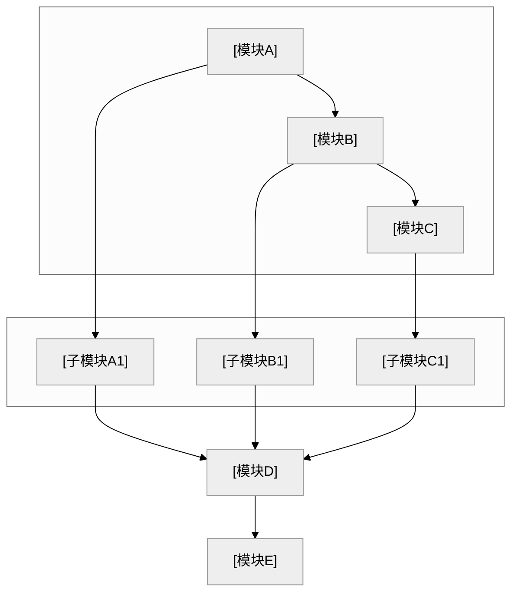

# 专利交底书模版参考（脱敏版）

本文档为技术交底书格式与章节要点参考，适用于多领域专利撰写。由 `disclosure_builder.md` 引用。

---

## 文档头部

```markdown
# 技术交底书

**申请人**：[待填写]
**保密信息**：请勿泄露
**申请人地址**：[待填写]
**交底书名称**：[待填写]
**内部编号**：[待填写]
**申请类型**：[待填写]
**IPR**：[待填写]
**评审日期**：[待填写]
**所属部门及负责人**：[待填写]
**所属产品/项目及三级成本中心**：[待填写]
**产品商业计划**：[待填写]
**发明完成地点**：[待填写]
**是否涉及合作开发**：[待填写]
**交底书撰写人**（与IPR、代理人的主要技术沟通人）：[待填写]
**电话**：[待填写]
**邮箱**：[待填写]
**所有发明人**（1）姓名；（2）工号；（3）身份证号码）：[待填写]
**第一发明人**：[待填写]
**发明人中是否有境外人员**（如有，请说明）：[待填写]

**专利类型**：发明

---
```

文件命名规则见 `disclosure_builder.md` §7.3。

---

## 1. 背景技术

简述本发明的背景技术（即在本发明提出之前的已有技术），包括：

- 技术领域背景知识
- 行业现状与技术路线
- **现有技术实现方案**：按技术方向分类列举，每条需包含专利号/文献标识、申请方、技术方案、应用场景、**局限性**、**公开源 URL（必填）**
- **检索说明**（置于本节开头）：写公开数据库名称与检索词（写法见 `prior_art_search.md`）
- 结尾总结：检索总结、**本发明与现有技术的本质区别**

> 检索渠道、链接格式与摘要要求以 Step 5 `prior_art_search.md` 为准。

---

## 2. 所要解决的问题

- 客观评价现有技术的缺点，说明会带来哪些技术问题
- 针对上述缺点，逐一正面描述本发明所要解决的技术问题
- 本发明无法解决的技术问题不必描述
- 简明扼要，为第四章详细方案做铺垫

---

## 3. 发明点概述

- 描述本发明与现有解决方案的关键区别点
- 说明本发明如何对现有解决方案作出了改进
- 列出核心创新点，每点简明定义
- 详细技术方案引用第四章（如「具体实现见 4.2.1」）
- 避免与第四章重复大段技术细节

---

## 4. 具体技术方案

详细说明本发明技术方案，可以借助方法流程图、产品结构图、系统框架图、电路图等阐述技术方案。给出实施本发明的最佳方式。

### 4.1 总体技术方案附图

- 应用场景的通用描述（脱敏：用分类A/B/C、场景X等）
- 本发明针对的问题与核心创新点概述

#### 系统框图

- 使用 **fenced mermaid**（推荐 `flowchart TB` / `LR` + `subgraph` 分层）；模块名抽象通用，避免业务术语
- B/W 主题与定稿工具见 `disclosure_builder.md` §7.4
- 布局宜层次清晰；复杂时可拆多张 mermaid 图

**mermaid 系统框图模版**（替换标题与模块名、连线；与 4.2 相同为 `` ```mermaid`` 围栏）：



### 4.2 总体技术方案实现过程

#### 模块功能说明

**重点**：各模块的**作用**和**模块间关联关系**，专利不强调输入输出。

- 作用：该模块在整体方案中的角色
- 关联关系：上下游依赖、数据流/控制流、闭环关系

#### 流程图

- 使用 **fenced mermaid** 代码块（规则见 `disclosure_builder.md` §7.4）。

#### 流程说明

- 用文字简要说明各步骤或与图中节点的对应关系（**不替代**流程图图示）
- 流程涉及算法、评分、约束或形式化变量时，在 **4.2.1** 集中给出符号定义与主公式

### 4.2.1 符号与公式

**撰写顺序**：先 **符号与变量定义** → 再 **核心公式**（含式 (1)）→ 再文字解释与流程衔接。

#### 符号表示例（Markdown 正文可直接采用）

```markdown
#### （1）任务侧符号

| 符号 | 含义 | 下标/量纲 |
|------|------|-----------|
| $i$ | 任务索引 | $i=1,\ldots,N$ |
| $b_{i,\mathrm{cpu}}$ | 任务 $i$ 的 CPU 需求权重 | 无量纲，$b_{i,\mathrm{cpu}}>0$ |
| $b_{i,\mathrm{mem}}$ | 任务 $i$ 的内存需求权重 | 同上 |

#### （2）节点侧符号

| 符号 | 含义 | 下标/量纲 |
|------|------|-----------|
| $j$ | 计算节点索引 | $j=1,\ldots,M$ |
| $a_{j,\mathrm{cpu}}$ | 节点 $j$ 的 CPU 资源饱和度 | 无量纲，$a_{j,\mathrm{cpu}}\le 0$ 表示有余量 |
```

#### 公式正/反例（体例见 `disclosure_builder.md` §7.7）

| 场景 | ✅ 推荐 | ❌ 避免 |
|------|---------|---------|
| CPU 维度权重 | $b_{i,\mathrm{cpu}}$ | $b_i^{cpu}$（上标易被读作幂次） |
| 节点饱和度 | $a_{j,\mathrm{cpu}} \le 0$ | $a_j^{cpu} \le 0$ |
| 多维度并列 | $b_{i,\mathrm{cpu}},\, b_{i,\mathrm{mem}}$ | $b_i^{cpu}, b_i^{mem}$ |
| 块级主公式 | `$$ M_{ij} = \alpha b_{i,\mathrm{cpu}} + \beta a_{j,\mathrm{cpu}} \tag{1} $$` 单行 | 块内多行 `\\` 换行堆叠 |
| 公式分隔符 | `$...$` / `$$...$$` | `\(...\)` / `\[...\]` |

### 4.2.2 关键技术参数

- 置信度/阈值类：含义、取值范围
- 算法参数：公式、约束条件
- 参数表须设 **「符号」列**，与 **4.2.1 符号表逐字同形**
- 确保与正文公式、实施例数值一致

### 4.3 具体实施例

- 应用场景（脱敏）
- 系统流程简述
- **参数设置示例**：注明「不作为权利要求限制」

### 4.4 替代方案

- 列出可替代的技术方案（如替代算法、替代参数、替代模块等）
- 说明替代方案同样能完成发明目的
- 有助于扩大专利保护范围，防止他人绕过

---

## 5. 有益效果

- 先概括性观点，再分点详述
- 与第二章解决的问题、第三章发明点呼应
- 技术细节以第四章为准，本章以论点为主
- 请从技术角度描述有益效果
- 如果技术手段本身是已知的，但技术手段的特定结合能够带来 1+1>2 的有益效果，请重点描述这种组合如何带来有益效果
