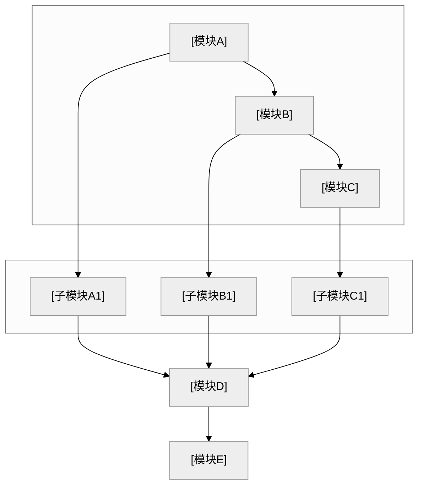

# 专利交底书模版参考（脱敏版）

本文档为技术交底书格式与章节要点参考，内容已脱敏，适用于多领域专利撰写。由 `disclosure_builder.md` 引用。

---

## 文档头部

```markdown
# 技术交底书

**案件名称**：[待填写]一种XXX方法及系统

**发明人**：[待填写]
**撰写人**：[待填写]
**技术联系人**：
- 姓名：[待填写]
- 电话：[待填写]
- 邮箱：[待填写]
**所属项目**：[待填写]
**项目阶段**：[待填写]
**申报时间要求**：无 □ 有 □

**专利类型**：发明

---
```

在用户产出目录保存时，**`.md` / `.docx` 主文件名**应为 **`{案件名称规范化}_{YYYYMMDDHHmmss}`**（占位去掉、非法字符、过长截断及时间戳规则见 `disclosure_builder.md` **§7.3**，**凡交付均须时间戳**），避免与标题无关的固定名。

---

## 一、缩略语和关键术语定义

- 列出交底书中出现的英文缩写及其全称和中文释义
- 列出关键专业术语的定义

---

## 二、详细介绍技术背景

- 技术领域背景知识
- 行业现状与技术路线
- 为第三章现有技术做铺垫

---

## 三、与本专利申请最接近的现有技术

### 3.1 现有技术的实现方案

- 检索渠道、链接格式与禁止事项以 Step 5 **`prior_art_search.md`** 为准（不在此重复）。
- **检索说明**（建议置于 3.1 开头）：写**公开数据库名称**与**检索词**；**勿**写 `cnipa_epub_search.py` 等脚本名或「查新降级」等流程用语（见 **`prior_art_search.md`「3.1 检索说明写法」**）
- 按**技术方向**分类列举（如：单标签方法、多标签方法、聚类策略等）
- 每条现有技术需包含：专利号 / 文献标识、申请方（或来源机构）、技术方案、应用场景、**局限性**、**公开源 URL（必填）**
  - **国知局 `abstract`**：若 Step 5 JSON 含 **`abstract`**，该条「技术方案」等叙述**必须先充分理解摘要后**再概括（见 **`prior_art_search.md`**）；交底书正文勿大段粘贴官方摘要全文。
  - **URL 要求**：与 `prior_art_search.md` 一致——每条**至少一个**可公开访问链接，**写入前验证**有效且与著录项一致；**禁止虚构链接**。
  - **正文呈现建议**：在每条方向下可用「**来源链接**：…」单独一行，或表格增列「链接」。
- 结尾总结：检索总结、**本发明与现有技术的本质区别**

### 3.2 现有技术存在的缺点

- 分点列举，与 3.1 的局限性呼应
- 突出**核心缺陷**：现有技术无法解决的问题

---

## 四、本专利申请所解决的技术问题

- 对应三、3.2 中的缺点，逐条说明本发明的解决思路
- 简明扼要，为第五章详细方案做铺垫

---

## 五、本专利申请技术方案的详细阐述

### 5.1 总体技术方案附图

- 应用场景的通用描述（脱敏：用分类A/B/C、场景X等）
- 本发明针对的问题与核心创新点概述
- 若有人工环节，说明前提条件（如：样本需具有可区分显著特征）

#### 系统框图

- 使用 **fenced mermaid**（推荐 `flowchart TB` / `LR` + `subgraph` 分层）；模块名抽象通用，避免业务术语
- **须** B/W 主题：围栏内首行为 `%%{init: {'theme': 'neutral', 'themeVariables': {'lineColor': '#000000', 'primaryColor': '#ffffff', 'primaryBorderColor': '#000000', 'edgeLabelBackground': '#ffffff'}}}%%`
- 定稿交付前经 **`mmdc`**（由 `build_docx.py` 调用）转为 PNG 并生成 Word；**不需要**再附 ASCII 文字框图（Word 中以图为准）
- 布局宜层次清晰；复杂时可拆多张 mermaid 图

**mermaid 系统框图模版**（替换标题与模块名、连线；与 5.2 相同为 `` ```mermaid`` 围栏）：



### 5.2 总体技术方案实现过程

#### 模块功能说明

**重点**：各模块的**作用**和**模块间关联关系**，专利不强调输入输出。

- 作用：该模块在整体方案中的角色
- 关联关系：上下游依赖、数据流/控制流、闭环关系

#### 流程图

- 使用 **fenced mermaid** 代码块；**不要** ASCII 文字/箭头流程图。
- 定稿交付前用 **`mmdc`**（由 `build_docx.py` 调用）转为 PNG 并生成 Word；失败时按终端提示用 **`md_to_docx.py`** 手动转换。

#### 流程说明

- 用文字简要说明各步骤或与图中节点的对应关系（**不替代**流程图图示）
- 流程涉及算法、评分、约束或形式化变量时，在 **5.2.1** 集中给出符号定义与主公式；须遵守 **`disclosure_builder.md` §7.7**

### 5.2.1 符号与公式

**撰写顺序**：先 **符号与变量定义** → 再 **核心公式**（含式 (1)）→ 再文字解释与流程衔接。

#### 符号表示例（Markdown 正文可直接采用）

```markdown
#### （1）任务侧符号

| 符号 | 含义 | 下标/量纲 |
|------|------|-----------|
| $i$ | 任务索引 | $i=1,\ldots,N$ |
| $b_{i,\mathrm{cpu}}$ | 任务 $i$ 的 CPU 需求权重 | 无量纲，$b_{i,\mathrm{cpu}}>0$ |
| $b_{i,\mathrm{mem}}$ | 任务 $i$ 的内存需求权重 | 同上 |

#### （2）节点侧符号

| 符号 | 含义 | 下标/量纲 |
|------|------|-----------|
| $j$ | 计算节点索引 | $j=1,\ldots,M$ |
| $a_{j,\mathrm{cpu}}$ | 节点 $j$ 的 CPU 资源饱和度 | 无量纲，$a_{j,\mathrm{cpu}}\le 0$ 表示有余量 |
```

#### 公式正/反例（体例必遵）

| 场景 | ✅ 推荐 | ❌ 避免 |
|------|---------|---------|
| CPU 维度权重 | $b_{i,\mathrm{cpu}}$ | $b_i^{cpu}$（上标易被读作幂次） |
| 节点饱和度 | $a_{j,\mathrm{cpu}} \le 0$ | $a_j^{cpu} \le 0$ |
| 多维度并列 | $b_{i,\mathrm{cpu}},\, b_{i,\mathrm{mem}}$ | $b_i^{cpu}, b_i^{mem}$ |
| 块级主公式 | `$$ M_{ij} = \alpha b_{i,\mathrm{cpu}} + \beta a_{j,\mathrm{cpu}} \tag{1} $$` 单行 | 块内多行 `\\` 换行堆叠（渲染易失败） |
| 逻辑连接 | 公式外写「且 $a_{j,\mathrm{mem}}\le 0$」 | 公式内 `\text{且}` |
| 公式分隔符 | `$...$` / `$$...$$` | `\(...\)` / `\[...\]`（pandoc 不识别） |

**行内/块级分隔符**：全文统一使用 `$...$` / `$$...$$`（禁止 `\(...\)` / `\[...\]`）；与 **`disclosure_builder.md` §7.7** 一致。

### 5.2.2 关键技术参数

- 置信度/阈值类：含义、取值范围
- 算法参数：公式、约束条件
- 参数表须设 **「符号」列**，与 **5.2.1 符号表逐字同形**（勿在 5.2.2 改用 `^{cpu}` 而上文用下标）
- 确保与正文公式、实施例数值一致

---

## 六、技术效果

- 先概括性观点，再分点详述
- 与第四章解决的问题、第七章保护点呼应
- 技术细节以第五章为准，本章以论点为主

---

## 七、关键点和欲保护点

- 列出核心创新点，每点简明定义
- 详细技术方案引用第五章（如「具体实现见 5.2.1」）
- 避免与第五章重复大段技术细节

---

## 八、替代方案

- 列出可替代的技术方案（如替代算法、替代参数、替代模块等）
- 说明替代方案同样能完成发明目的
- 有助于扩大专利保护范围，防止他人绕过

---

## 九、其他资料

- 列出已查阅的相关资料（专利、论文、技术文档等）
- 仅列明标题和出处，资料全文以电子附件形式提供

---

## 脱敏检查表

| 检查项 | 脱敏方式 |
|--------|----------|
| 业务/行业名称 | 抽象为通用描述 |
| 具体分类标签 | 分类A、分类B、分类C 等 |
| 具体数值 | 用「一定规模」「预设值」等 |
| 公司/产品名 | 删除或「某系统」 |

---

## 交付正文禁忌（勿写入交底书）

- **禁止**在全文任意位置（尤其**文末**）加入技能仓库、示例仓库、`patent-disclosure-skill`、`examples/` 路径、「教学/虚构示例」「不构成法律或技术承诺」等**元脚注**；交付物视为正式技术交底书文稿，**止于第九章**。
- **禁止输出**「注意事项」章节（内部撰写指引，非正式正文）。

## 公式与参数一致性检查

- 全文公式表述统一（如：置信度权重、密度调整系数）
- **符号体例**：资源维度用下标 `_{\mathrm{cpu}}` 等，**无** `^{cpu}`/`^{mem}` 类上标维度写法
- **符号表完整**：5.2.1 已定义符号；式 (1) 及后文每个符号均在表中出现；**无**同一字母多义
- **公式正确性与逻辑**：各式无笔误；不等式方向与文字一致；公式与 5.2 流程/模块可互推；边界情形不矛盾
- **跨节同形**：5.2.1、5.2.2「符号」列、第五章 5.3 实施例与正文公式 **逐字一致**
- 阈值范围一致（如 0.5–1.5、0.8–1.2）
- 参数命名统一（避免同义不同名混用）
- LaTeX 分隔符全文统一使用 `$...$` / `$$...$$`（禁止 `\(...\)` / `\[...\]`）
- 实施例数值与 5.2.2 节对应
